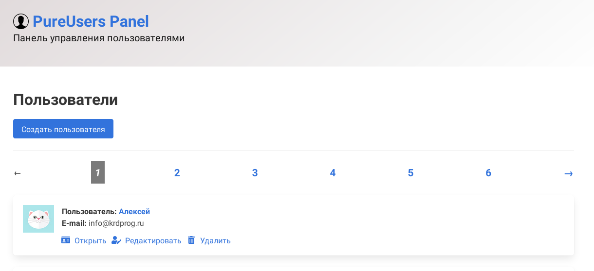
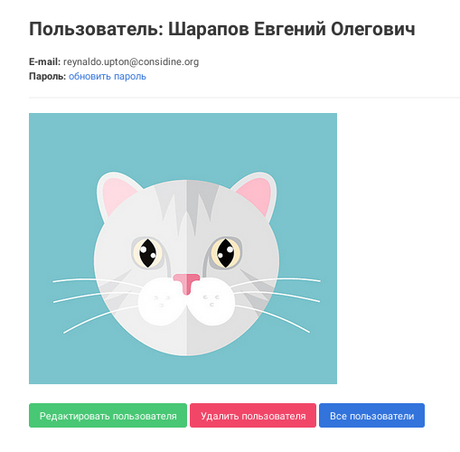

# Ruby on Rails приложение PureUsers

**PureUsers Panel** &mdash; это панель управления пользователями.

**Демо:** [https://pure-users-2020.herokuapp.com/](https://pure-users-2020.herokuapp.com/)

## Функционал:

Панель управления позволяет просматривать, создавать, изменять и удалять пользователей.

## Зависимости и версии Ruby on Rails/Ruby:

- Проект разработан на Ruby on Rails версии 6.0.2.1 и Ruby версии 2.6.4

- Для обработки изображений используется гем carrierwave и mini_magick.

- Внешний вид построен на базе CSS фреймворка [Bulma](https://bulma.io/).

## Как установить:

```bash
bundle install
rake db:migrate
```

## Как запустить:

Введите в терминале (находясь в корневом каталоге проекта):

```bash
rails s
```

И, откройте в браузере адрес [http://localhost:3000/](http://localhost:3000/)

## Наполнение проекта демонстрационными профилями пользователей:

Для ознакомления с проектом разработан функционал наполнения демонстрационными профилями пользователей (создаются пользователи с заполненными именами, уникальными e-mail адресами, паролями и аватарками).

Источник аватарок: [Design вектор создан(а) freepik - ru.freepik.com](https://ru.freepik.com/free-photos-vectors/design)

**Чтобы наполнить проект демонстрационными профилями, введите команду:**

```bash
bundle exec rake db:migrate:reset
bundle exec rake db:seed
```

## Внешний вид:

**Список пользователей:**



**Карточка пользователя:**



## Документация RESTful JSON API приложения:

|  Action    |  Method    |  Path    |  Comment    |
|-------|-------|-------|-------|
| **List** | GET | /api/v1/users | Просмотр списка пользователей |
| **Create** | POST | /api/v1/users | Создать нового пользователя |
| **Read** | GET | /api/v1/users/:id | Просмотр пользователя |
| **Update** | PATCH, PUT | /api/v1/users/:id | Изменить пользователя |
| **Delete** | DELETE | /api/v1/users/:id | Удалить пользователя |


## ToDo &mdash; что планируется реализовать:

- удалять аватар при удалении профиля
- если написать существующую в БД почту заглавными, выпадет ошибка (при валидации на уникальность). закончить решение вопроса
- на демо-сайте (на Heroku) не отображаются фотографии. Выгружать фото на внешний источник (Heroku не хранит фото) 
- доработать Create and Update в RESTful Json API
- покрыть важные куски кода тестами
- сделать индивидуальные title для страниц

## Лицензия и автор:

**Автор:** Алексей Цаплин-Купайсинов (@krdprog)

**Лицензия:** MIT License
